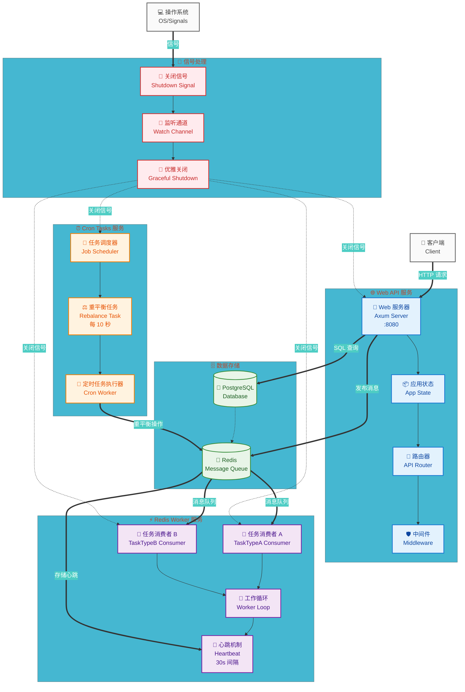

# 🏗️ Rust 后端服务架构流程图

## 📋 系统架构概览

本图展示了 Rust 后端服务的完整架构，包含三个主要板块：Web API、Redis Worker 和 Cron Tasks。

## 🎯 Mermaid 流程图

## 🎨 架构说明

### 🌐 Web API 服务
- **功能**: 处理 HTTP 请求，提供 REST API 接口
- **端口**: 8080
- **组件**: Axum Web 服务器 + 路由器 + 中间件
- **特性**: 支持 OpenAPI 文档生成，优雅关闭

### ⚡ Redis Worker 服务  
- **功能**: 处理异步任务消费
- **消费者**: TaskTypeA 和 TaskTypeB 两种任务类型
- **特性**: 心跳机制（30秒间隔）、并发处理（最多5条消息）、自动重连

### ⏰ Cron Tasks 服务
- **功能**: 执行定时任务
- **任务**: Redis 消息重平衡（每10秒执行）
- **调度器**: 基于 tokio-cron-scheduler

### 🗄️ 数据存储
- **PostgreSQL**: 主数据库，存储业务数据
- **Redis**: 消息队列 + 缓存，支持任务队列和心跳存储

### 🛑 信号处理
- **监听**: Ctrl+C 和 SIGTERM 信号
- **通知**: 通过 watch::channel 广播关闭信号
- **优雅关闭**: 确保所有服务完成当前工作后再退出

## 🔧 预览方式

您可以通过以下方式预览此 Mermaid 图：

1. **🌐 在线预览**: 
   - 访问 [mermaid.live](https://mermaid.live) 
   - 复制上述 Mermaid 代码到编辑器

2. **💻 本地预览**:
   - GitHub/GitLab 仓库中直接渲染
   - VS Code 安装 Mermaid 预览插件
   - 支持 Mermaid 的 Markdown 编辑器

3. **📱 移动端**:
   - GitHub Mobile 应用
   - 支持 Mermaid 的移动端 Markdown 查看器

## 🚀 技术特性

- ✅ **并发处理**: 使用 `tokio::try_join!` 实现真正的并发启动
- ✅ **优雅关闭**: 避免数据丢失和资源泄露  
- ✅ **健康检查**: Redis 消费者定期发送心跳
- ✅ **错误处理**: 使用 `color-eyre` 提供详细的错误信息
- ✅ **性能优化**: 消息批处理、并发限制、连接复用

---

*🎯 此流程图展示了现代异步 Rust 应用的最佳实践架构。*
