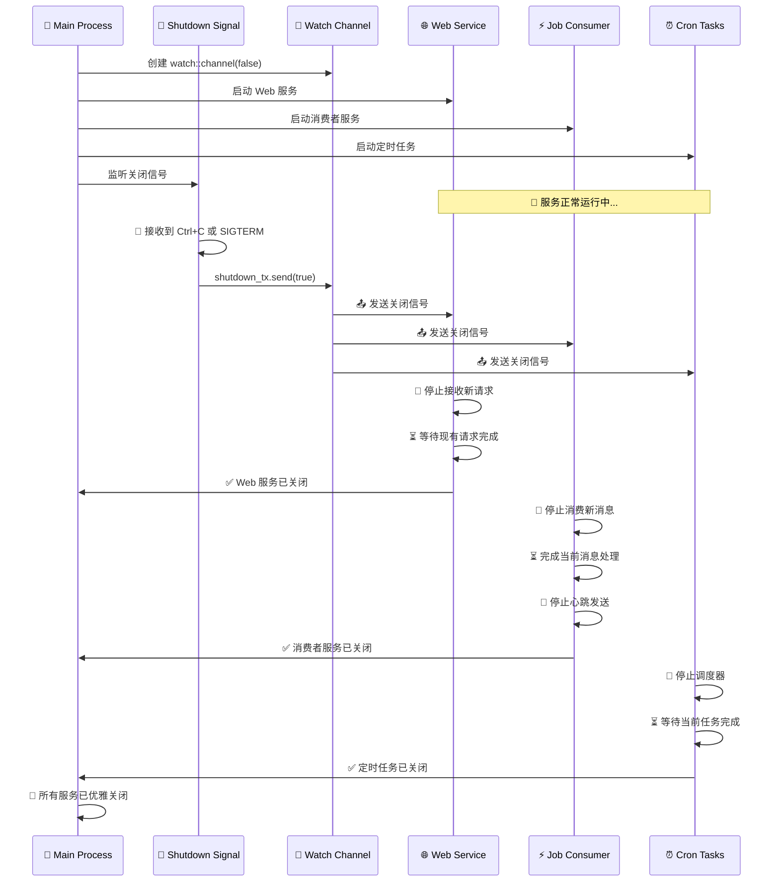

# 🚀 Rust 后端服务启动与生命周期管理

## 📋 服务架构概览

本文档描述了 Rust 后端服务的启动过程和优雅关闭机制。

## 🔄 服务启动流程图

```mermaid
graph TD
    A[🚀 main函数启动] --> B[⚙️ 初始化配置]
    B --> C[🗄️ 初始化数据库连接池]
    C --> D[📡 创建 watch::channel]
    D --> E[🔀 try_join! 启动并发任务]
    
    E --> F[🌐 start_web_service]
    E --> G[⚡ start_job_consumers]
    E --> H[⏰ start_cron_tasks]
    E --> I[🛑 start_shutdown_signal]
    
    F --> F1[创建 AppState]
    F1 --> F2[构建 Axum Router]
    F2 --> F3[绑定 TCP 监听器 :8080]
    F3 --> F4[🔄 with_graceful_shutdown]
    F4 --> F5[等待 shutdown_rx 信号]
    
    G --> G1[创建 TaskTypeA 消费者]
    G --> G2[创建 TaskTypeB 消费者]
    G1 --> G3[启动消费者工作循环]
    G2 --> G3
    G3 --> G4[🔄 consumer_task_worker]
    G3 --> G5[💓 consumer_task_send_heartbeat]
    G4 --> G6[等待 shutdown_rx 信号]
    G5 --> G6
    
    H --> H1[创建 JobScheduler]
    H1 --> H2[添加重平衡任务]
    H2 --> H3[启动调度器]
    H3 --> H4[🔄 wait_for_shutdown]
    H4 --> H5[等待 shutdown_rx 信号]
    
    I --> I1[监听 Ctrl+C 信号]
    I --> I2[监听 SIGTERM 信号]
    I1 --> I3[🚨 接收到关闭信号]
    I2 --> I3
    I3 --> I4[📤 shutdown_tx.send(true)]
    
    I4 --> F5
    I4 --> G6
    I4 --> H5
    
    F5 --> F6[🛑 Web 服务优雅关闭]
    G6 --> G7[🛑 消费者服务优雅关闭]
    H5 --> H8[🛑 定时任务优雅关闭]
    
    F6 --> Z[✅ 程序退出]
    G7 --> Z
    H8 --> Z
    
    style A fill:#e1f5fe
    style D fill:#f3e5f5
    style I3 fill:#ffebee
    style Z fill:#e8f5e8
    style F4 fill:#fff3e0
    style G6 fill:#fff3e0
    style H4 fill:#fff3e0
```

## 🔄 优雅关闭信号传播时序图



## 🏗️ 服务架构详细说明

### 1. 🌐 Web Service (start_web_service)
- **功能**: 提供 HTTP API 接口和文档服务
- **端口**: 8080
- **优雅关闭**: 使用 `with_graceful_shutdown` 等待现有请求完成
- **状态管理**: 包含 `ProjectRepository` 用于数据库操作

### 2. ⚡ Job Consumers (start_job_consumers)
- **功能**: 处理 Redis 消息队列任务
- **消费者类型**: 
  - TaskTypeA 消费者
  - TaskTypeB 消费者
- **关键特性**:
  - 💓 心跳机制 (每 30 秒)
  - 🔄 自动重连
  - 📊 并发处理 (最多 5 条消息)
  - 🛑 优雅关闭监听

### 3. ⏰ Cron Tasks (start_cron_tasks)
- **功能**: 执行定时任务
- **任务类型**: Redis 消息重平衡 (每 10 秒)
- **调度器**: 基于 `tokio-cron-scheduler`
- **优雅关闭**: 使用 `wait_for_shutdown` 等待任务完成

### 4. 🛑 Shutdown Signal Handler
- **监听信号**:
  - Ctrl+C (所有平台)
  - SIGTERM (Unix 系统)
- **通知机制**: 通过 `watch::channel` 广播关闭信号
- **优雅关闭**: 确保所有服务完成当前工作后再退出

## 📊 关键技术特性

### 🔄 并发处理
- 使用 `tokio::try_join!` 实现真正的并发启动
- 任一服务失败都会触发整体关闭

### 💓 健康检查
- Redis 消费者定期发送心跳
- 心跳信息存储在 Redis 哈希表中
- 包含流名称、消费者名称和时间戳

### 🛡️ 错误处理
- 使用 `color-eyre` 提供详细的错误信息
- 连接失败时自动重试 (5 秒间隔)
- 优雅的错误日志记录

### 🔒 安全关闭
- 避免数据丢失和资源泄露
- 防止与外部系统的异常交互
- 减少不必要的错误日志

## 📈 性能优化

- **消息批处理**: 每次最多处理 10 条消息
- **并发限制**: 最多 5 条消息并发处理
- **连接复用**: 使用 Redis 连接管理器
- **阻塞读取**: 1 秒超时避免 CPU 空转

---

*🎯 此文档为 Rust 后端服务的技术架构说明，展示了现代异步 Rust 应用的最佳实践。*
